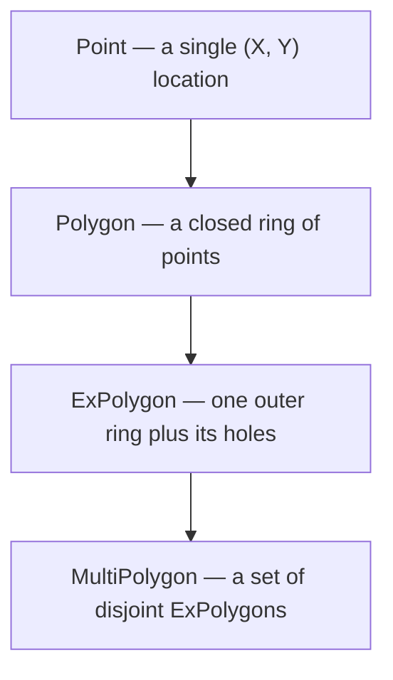

# Anatomy of polyclip

`polyclip` does two families of things to two-dimensional shapes:

- **Boolean operations** — combine two shapes with set logic: union,
  intersection, difference, and symmetric difference.
- **Offset** — grow a shape outward or shrink it inward by a fixed distance.

Everything else in the library exists to describe the shapes these operations
consume and produce. This document lays out how those descriptions are
structured.

## The type ladder

`polyclip` builds its idea of a "shape" in four layers, each one composed of
the layer below it.

- **`Point`** is a location in the plane. It carries no meaning beyond its two
  coordinates; the units are whatever you decide they are.
- **`Polygon`** is a single closed loop of points — a *ring*. It encloses an
  area but has no notion of holes.
- **`ExPolygon`** ("extended polygon") is one outer ring together with zero or
  more holes punched out of it. This is the smallest unit that can describe a
  region with a hole in it.
- **`MultiPolygon`** is a collection of `ExPolygon` values that do not overlap.
  It can describe several separate islands at once, each with its own holes.

The four layers correspond to four increasingly capable answers to the
question "what region of the plane am I talking about?" A `Polygon` can only
describe a solid blob. An `ExPolygon` can describe a blob with holes. A
`MultiPolygon` can describe any region a boolean operation might produce —
several blobs, some with holes, some without.

## The one principle: MultiPolygon in, MultiPolygon out

Every boolean and offset operation accepts a `MultiPolygon` and returns a
`MultiPolygon`. This is the single most important fact about the library's
shape.

The reason is that the operations are *not closed* over the smaller types. The
union of two simple blobs might be a single blob, or it might leave a hole, or
the difference of two blobs might split one shape into two pieces. Only
`MultiPolygon` is rich enough to express any of those outcomes, so it is the
only type that can serve as both input and output without loss.

A practical consequence: there is no separate "clean up the result" step you
have to run before the output is usable. The result of any operation is
already a well-formed `MultiPolygon` you can feed straight into the next
operation.

## Public surface versus engine

The top-level `polyclip` package is the entire stable, public API: the four
shape types, the boolean operations, offset, and a handful of utility methods
(area, winding, containment, bounding box, validation, cleaning).

Underneath it sit two subpackages:

- **`clip/`** — the scanline boolean engine that actually computes unions,
  intersections, and so on.
- **`fixed/`** — the integer-grid coordinate arithmetic the engine relies on
  for numeric robustness (see [05-numeric-robustness.md](05-numeric-robustness.md)).

These subpackages are exported only so the project's own tests can address
them. They are implementation detail. You never need to touch them to use the
library, and their contents are not part of the stable API. The terms you
would meet there — *sweep*, *active edge list*, *bound* — live in the
[glossary](08-glossary.md) and in [`../DESIGN.md`](../DESIGN.md).

## Units

`polyclip` never interprets your coordinates. A `Point` holds two `float64`
values, and whether those mean millimetres, pixels, or astronomical units is
entirely up to you. The only requirement is that you use the same units
consistently within a single operation. Offset distances and tolerances are
expressed in those same units.
