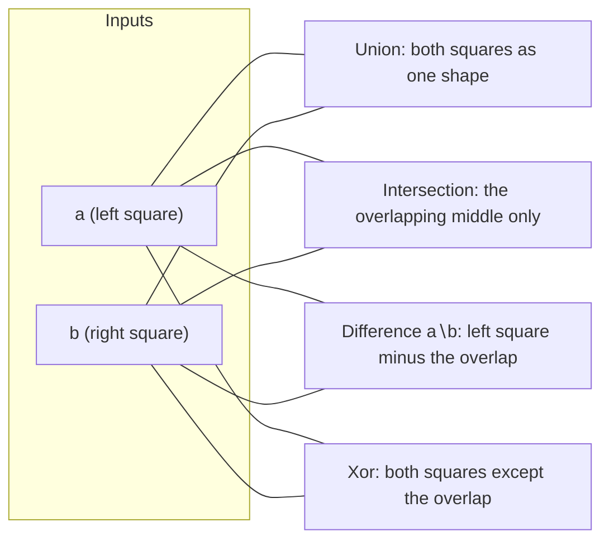

# Boolean operations

The four boolean operations treat each `MultiPolygon` as a *region* — a set of
points in the plane — and combine two regions with [set logic](https://en.wikipedia.org/wiki/Set_(mathematics)).
The names come straight from
[set theory](https://en.wikipedia.org/wiki/Boolean_algebra).

## The four operations

Let `a` and `b` be the two input regions.

- **Union** (`a ∪ b`) — every point in `a`, in `b`, or in both. The combined
  coverage of the two shapes.
- **Intersection** (`a ∩ b`) — only the points in *both* `a` and `b`. The
  overlap.
- **Difference** (`a ∖ b`) — the points in `a` that are *not* in `b`. The
  region `b` is treated as a cookie-cutter that removes material from `a`.
  Unlike the other three, difference is not symmetric: `a ∖ b` and `b ∖ a` are
  different shapes.
- **Symmetric difference** (`a ⊕ b`, exposed as *Xor*) — the points in exactly
  one of the two inputs, equal to `(a ∪ b) ∖ (a ∩ b)`. The union with the
  overlap punched back out.

For two overlapping squares, the four operations carve up the plane like this:

## Why the result is a MultiPolygon

Each operation returns a `MultiPolygon` because the result's shape is not
predictable from the inputs' shapes:

- A union of two overlapping blobs is one piece, but a union of two distant
  blobs is two.
- An intersection may be empty, one piece, or several.
- A difference can split one shape into two, or open a hole in it, or leave it
  untouched.

Only `MultiPolygon` can express all of these, which is why it is both the input
and output type (see [00-anatomy.md](00-anatomy.md)).

## Shortcuts the operations take

The operations recognise a few cases where the answer is obvious and skip the
engine entirely. These are not approximations — they are the exact results,
reached cheaply:

- **Empty inputs.** Union with an empty region returns the other region
  unchanged. Intersection with an empty region is empty. Difference of an empty
  region is empty; difference *by* an empty region returns the original.
- **Disjoint bounding boxes.** If the two inputs' bounding boxes do not even
  touch, the shapes cannot overlap. Union and symmetric difference then reduce
  to simply listing both inputs side by side; intersection is empty; difference
  returns the first input unchanged.
- **Identical inputs.** When `a` and `b` are exactly equal, the answers follow
  from the algebra: union and intersection both return `a`, while difference
  and symmetric difference are empty.

When none of these apply, the inputs go through the scanline engine, which
computes the result by sweeping a line across the plane and tracking which
regions it is inside (see the [glossary](08-glossary.md) and
[`../DESIGN.md`](../DESIGN.md)).

## Unioning many shapes at once

Combining a long list of shapes into one is common enough to have its own
operation, `UnionAll`. Rather than folding the list one shape at a time — which
would re-process the growing accumulator over and over — it pairs the inputs up
in a tournament: union neighbours, then union the results, and so on until one
shape remains. The end result is identical to repeated pairwise union; the
tournament structure is what keeps the total work proportional to the number of
inputs rather than to its square.
