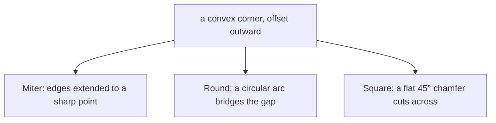

# Offset

**Offsetting** moves a region's boundary inward or outward by a fixed
distance, producing a fatter or thinner version of the shape. It is the
operation behind tool-path generation, clearance margins, and stroke-to-outline
conversion.

## Inflation and erosion

Offset takes a single signed distance, `d`:

- **Positive `d` inflates** the region — it grows outward by `d` in every
  direction. Formally this is the
  [*Minkowski sum*](https://en.wikipedia.org/wiki/Minkowski_addition) of the
  region with a disk of radius `d`: imagine rolling a disk of that radius around the outside of the
  shape and taking everything the disk sweeps, plus the original. Corners
  become rounded or extended; the shape gets uniformly fatter.
- **Negative `d` erodes** the region — it shrinks inward by `|d|`. This is the
  [*Minkowski erosion*](https://en.wikipedia.org/wiki/Erosion_(morphology)):
  everything that survives after shaving `|d|` off every boundary.

The same single number drives both: the sign chooses the direction, the
magnitude chooses how far.

## How holes and direction interact

Offset respects the outer/hole convention. With the standard winding (outer
counter-clockwise, holes clockwise), a positive `d` grows the outer boundary
outward *and* shrinks the holes — both changes make the solid region larger.
A negative `d` does the reverse: the outer shrinks and the holes grow, so the
solid region gets smaller from both sides. In other words, "positive grows the
material" is the consistent rule, and holes are handled so that it stays true.

## When a region disappears

Erosion can shrink a feature out of existence. A hole narrower than `2·|d|`
closes up entirely, and an inward offset removes it. An outer ring smaller than
the offset can wear away to nothing, in which case that whole piece drops out
of the result. If *every* piece vanishes this way — for instance, an inward
offset larger than the entire shape — the operation returns an empty
`MultiPolygon` with a nil error. An empty result is a valid outcome (the same
way intersecting two disjoint shapes yields nothing), not a failure.

## Corner joins

The interesting choices in offsetting are all about **corners**. When you push
two edges of a convex corner outward, they no longer meet — a wedge-shaped gap
opens up between them, and something has to fill it. The shape used to fill that
gap is the **join**, selected by `JoinType`:

- **[Miter](https://en.wikipedia.org/wiki/Miter_joint)** (`JoinMiter`) — extend
  both offset edges until they meet at a sharp point, reproducing the original
  corner. This is the default.
- **Round** (`JoinRound`) — fill the gap with a circular arc, giving a rounded
  corner. The arc is approximated by short straight segments.
- **Square** (`JoinSquare`) — cut the corner off with a flat 45° face,
  regardless of the corner's actual angle.

(At a *reflex* corner offset outward — or any corner under inward offset where
the edges cross rather than separate — there is no gap to fill, and the offset
edges simply meet at their intersection. The join choice only matters where a
gap actually opens.)

### The miter limit

A miter at a very sharp corner produces a long, thin spike: the sharper the
angle, the farther the point juts out. Left unchecked, a near-degenerate corner
would produce an absurdly long spike. The **miter limit** (`MiterLimit`) caps
this. It is a multiplier on `|d|`; once the miter point would extend past
`MiterLimit · |d|` from the corner, the join falls back to a flat cut — a
[**chamfer**](https://en.wikipedia.org/wiki/Chamfer) — instead of the spike.
The default limit is `2.0`.

### Arc tolerance

A round join is an arc, but the output is made of straight segments, so the arc
is [*tessellated*](https://en.wikipedia.org/wiki/Tessellation) — broken into a
chain of short chords. **Arc tolerance**
(`ArcTol`) controls how fine that approximation is: it is the maximum distance,
in your coordinate units, that a chord is allowed to deviate from the true arc.
A smaller tolerance means more, shorter segments and a smoother curve. The
default is one percent of `|d|`.

## End type

`EndType` describes how the *ends* of a path are treated when offsetting. The
library offsets closed regions, so the only end type is `EndPolygon`: the input
is a closed area, offset as the Minkowski sum or erosion described above.
